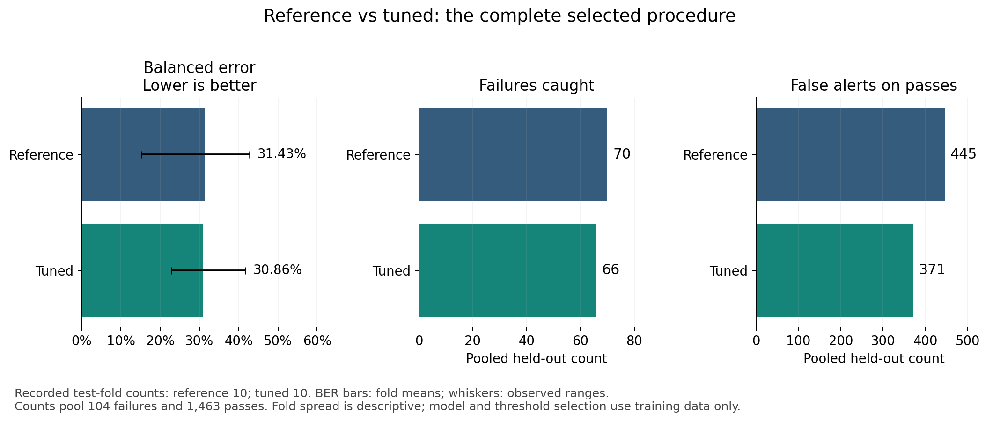

# SECOM Yield Monitoring

[](https://github.com/stevennitesh/secom-yield-monitoring/actions/workflows/ci.yml)

**Can manufacturing measurements identify failures, and do those patterns hold in later samples?**

A reproducible ML engineering case study using the public [UCI SECOM dataset](https://archive.ics.uci.edu/dataset/179/secom).

| Samples | Anonymous measurements | Failures | Missing measurement cells |
| ---: | ---: | ---: | ---: |
| 1,567 | 590 | 104 (6.64%) | 4.54% |

Predicting pass for everyone gives **93.36% accuracy but catches no failures**. We therefore use **balanced error**: the average of missed-failure and false-alert rates. Lower is better.

[Visual case study](docs/results/README.md) | [Technical report](docs/results/final_report.md)

## Tuning Made a Tradeoff

| Complete training-selected procedure | Balanced error | Failure recall | Pass specificity | Failures caught / false alerts |
| --- | ---: | ---: | ---: | ---: |
| Reference: 40 selected inputs | 31.43% | 67.55% | 69.59% | 70 / 445 |
| Tuned: 10, 20 or 40 inputs | 30.86% | 63.64% | 74.65% | 66 / 371 |
| Always predict pass | 50.00% | 0.00% | 100.00% | 0 / 0 |

Tuning produced **74 fewer false alerts and caught 4 fewer failures**. Mean balanced error fell by **0.57 percentage points**: five paired test folds improved, four worsened and one tied.



The chart compares the complete training-selected procedures. Input-mode contrasts appear in the supporting results. Recall measures failures caught; specificity measures passes left unflagged. Rates average ten unseen test folds; counts pool 104 failures and 1,463 passes. Error SD is 8.02 points for the reference and 6.18 for tuning, describing fold variation.

## What Was Built

| Engineering choice | Purpose and evidence |
| --- | --- |
| Same ten outer folds; three inner folds choose inputs, model, settings and threshold | Fair reference-versus-tuned comparison; [study workflows](src/secom/workflows/) |
| Training-only imputation, scaling and six feature-selection methods | Prevent test labels from shaping the procedure; [regression tests](tests/) |
| Earlier fitting, separate calibration and three disjoint later test periods | Check chronological transfer; [results and limits](docs/results/README.md#3-later-samples-expose-transfer-limits) |
| Saved predictions, source/input hashes and independent artifact audits | Trace results to an execution; [provenance](docs/results/README.md#evidence) |
| Vectorized ReliefF scoring, bounded caches and reusable calculations | A controlled historical run fell from 76.10 to 20.95 minutes (3.63×), with 26 scientific CSVs byte-identical; [performance evidence](docs/performance.md) |

**Stack:** Python · NumPy/pandas · SciPy · scikit-learn/skrebate · Matplotlib · pytest/Ruff.

Custom work covers study orchestration, selection and calibration, the ReliefF accelerator, artifact audits and reporting. Estimators come from scikit-learn; the accelerator extends skrebate. The speed comparison is one controlled Windows pair on an earlier workload.

Kernel ridge regression learns nonlinear similarities; logistic regression learns a weighted input combination. Explicit feature engineering adds missing-measurement flags. Ratios, interactions and historical trends were not systematically explored.

The later-sample tests exposed weak transfer and unstable alert volume: the main kernel-ridge procedure flagged **88.5%** of later samples. Calibration contained only **3-6 failures**. These are secondary stress findings; the final later block is retrospective. Anonymous measurements with unknown collection timing cannot establish causes, early warning or production readiness. The [visual case study](docs/results/README.md) shows the evidence and next data requirements.

## Run Locally

Use Python 3.11 or 3.12:

```bash
python -m venv .venv
```

Activate with `.venv\Scripts\Activate.ps1` in PowerShell or `source .venv/bin/activate` in Bash, then:

```bash
python -m pip install -r requirements.txt
python -m pip install -e . --no-build-isolation
```

Quick verification uses synthetic fixtures and needs no dataset download:

```bash
python -m pytest -q tests/test_relief_backend.py tests/test_model_score_cache.py
```

To reproduce the complete study:

```bash
python scripts/fetch_secom.py --output-dir data/raw
python scripts/run_full_study.py --input-dir data/raw --output-dir runs/full_study --classifiers krr,logreg --progress --strict
```

The latest full run took about **24 minutes** on one Windows machine; this is an observed budget, not a hardware-independent guarantee. Use a fresh output directory. Read `runs/full_study/reports/final_report.md` when it finishes. Raw data and full runs stay gitignored; Git keeps the compact report, six figures and provenance records under `docs/results/`.

<details>
<summary>Additional checks and study commands</summary>

<a id="additional-commands"></a>

Commands assume the environment is active. Benchmark entrypoints default to kernel ridge; the full-study command above includes both models.

| Task | Command |
| --- | --- |
| Full test suite | `python -m pytest -q` |
| Lint | `python -m ruff check src tests scripts` |
| Format check | `python -m ruff format --check src tests scripts` |
| Reference benchmark | `python scripts/run_original_replication.py --input-dir data/raw --output-dir runs/original_replication --strict` |
| Tuned benchmark | `python scripts/run_benchmark_tuned.py --input-dir data/raw --output-dir runs/benchmark_tuned --strict` |
| Both benchmarks | `python scripts/run_benchmark_replication.py --input-dir data/raw --output-dir runs/benchmark_replication --strict` |
| Chronological study | `python scripts/run_temporal_robustness.py --input-dir data/raw --output-dir runs/temporal_robustness --strict` |
| Audit a completed run | `python scripts/run_audit.py --output-dir runs/full_study --strict` |
| Regenerate its report | `python scripts/run_final_report.py --output-dir runs/full_study` |
| Deliberately replace the public snapshot | `python scripts/export_results.py --output-dir runs/full_study` |

The [development guide](docs/development.md) explains evidence preservation, source matching and presentation-only refreshes.

</details>

[Documentation map](docs/README.md) | [Developer guide](docs/development.md) | [Study specifications](docs/spec/README.md)

Dataset: McCann and Johnston, [UCI SECOM, DOI 10.24432/C54305](https://archive.ics.uci.edu/dataset/179/secom), CC BY 4.0. The raw file has 590 measurements versus 591 in public metadata; the technical report documents the discrepancy. Software: [MIT license](LICENSE). The dataset retains its separate CC BY 4.0 attribution.
