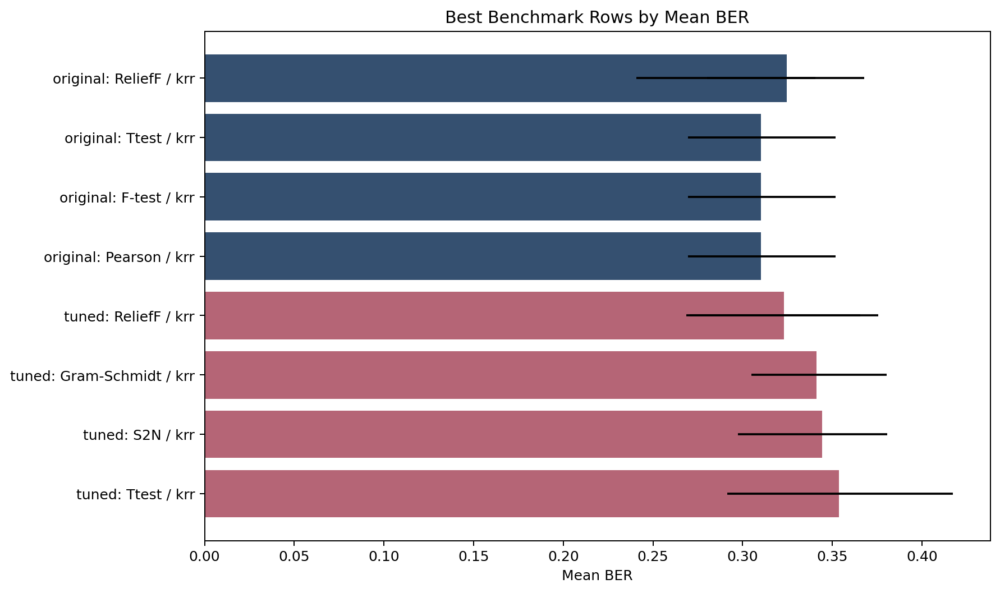
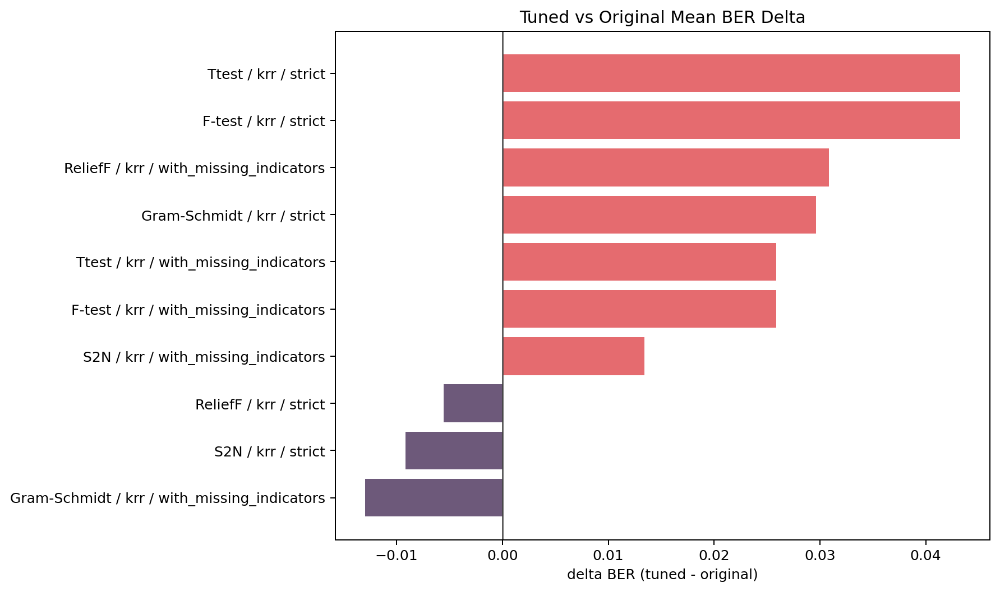
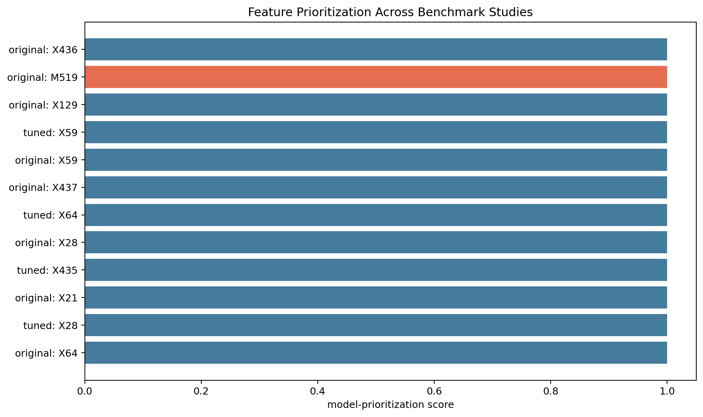
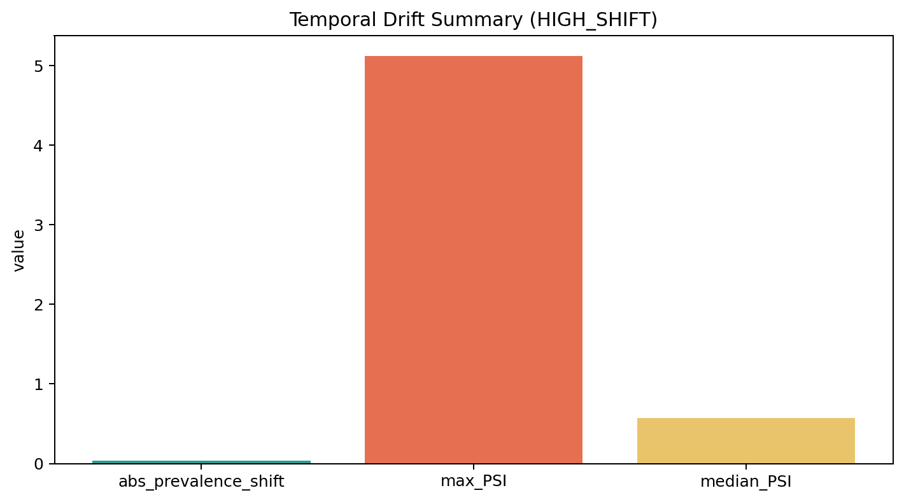
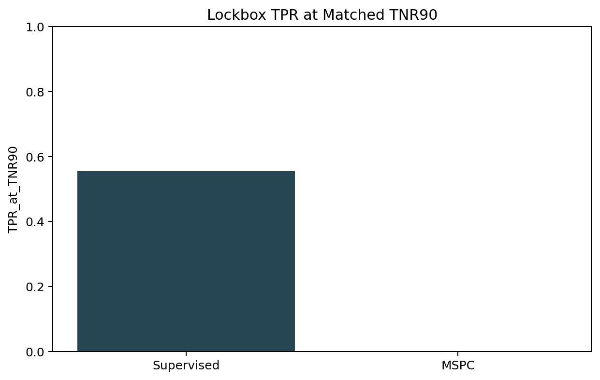
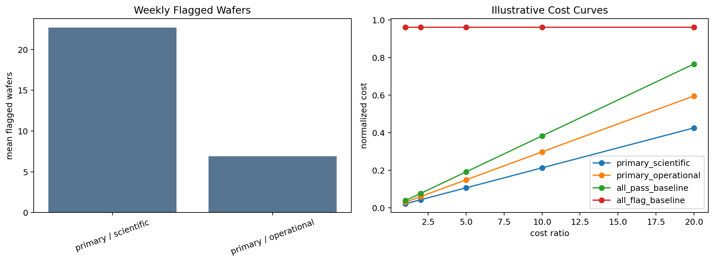

# SECOM Benchmark-First Yield Monitoring Study

_Generated: 2026-06-06 15:17_
_Source run: `runs/full_study`_

This report summarizes the benchmark replication, tuned benchmark, and temporal robustness outputs from the active SECOM study artifacts. The benchmark results are the primary evidence; the temporal study is a stricter stress test of robustness under chronological shift.

## Executive Summary

- The benchmark studies support a credible yield-prediction signal in the SECOM sensor and process measurements.
- The strongest original replication row is `ReliefF` / `krr` / `with_missing_indicators` with mean BER `0.292`.
- The strongest tuned benchmark row is `ReliefF` / `krr` / `strict` with mean BER `0.319`.
- The tuned benchmark should be read as the more conservative estimate because hyperparameters are selected inside nested cross-validation.
- The temporal study selected `ReliefF` as the primary chronological candidate.
- There are `1` active temporal claim restriction(s); temporal lockbox findings remain descriptive rather than confirmatory.

## What I Built

- A reproducible original benchmark replication workflow that keeps preprocessing and feature selection strictly inside the training folds.
- A tuned benchmark workflow that preserves the selector family while adding nested hyperparameter search and threshold-free inner selection.
- A temporal robustness workflow with chronological DEV/LOCKBOX evaluation, drift gating, and explicit claim restrictions.
- Artifact-driven audit and reporting outputs so results can be traced back to versioned manifests, metrics tables, and study statuses.

## Dataset and Study Scope

The active study is intentionally benchmark-first. It asks whether SECOM process measurements contain usable signal for downstream fail detection under a faithful literature-style protocol, then whether a stricter tuned benchmark changes that conclusion, and finally how those findings behave under future-looking temporal stress. This ordering matters: the benchmark studies support the core claim, while the temporal study tests robustness without being allowed to erase valid benchmark evidence by default.

## Original Replication Design

The original replication keeps a fixed feature budget, compares the literature-style selector and classifier families, and treats missing-indicator features as a paired ablation. The key result is not just the best row, but the fact that multiple selector/classifier combinations remain materially better than trivial failure detection.
Original classifier configurations are selected from the same non-nested replication sweep used for reporting, so tuned benchmark results remain the stricter estimate.

## Original Replication Search Summary

### Original Search Space

| selector | classifier | mode | evaluated_configs | k_values | c_values | alpha_values | gamma_values | n_neighbors_values |
|---|---|---|---|---|---|---|---|---|
| S2N | krr | strict | 12 | 1 | 0 | 3 | 3 | 0 |
| S2N | krr | with_missing_indicators | 12 | 1 | 0 | 3 | 3 | 0 |
| Ttest | krr | strict | 12 | 1 | 0 | 3 | 3 | 0 |
| Ttest | krr | with_missing_indicators | 12 | 1 | 0 | 3 | 3 | 0 |
| F-test | krr | strict | 12 | 1 | 0 | 3 | 3 | 0 |
| F-test | krr | with_missing_indicators | 12 | 1 | 0 | 3 | 3 | 0 |
| ReliefF | krr | strict | 12 | 1 | 0 | 3 | 3 | 1 |
| ReliefF | krr | with_missing_indicators | 12 | 1 | 0 | 3 | 3 | 1 |
| Gram-Schmidt | krr | strict | 12 | 1 | 0 | 3 | 3 | 0 |
| Gram-Schmidt | krr | with_missing_indicators | 12 | 1 | 0 | 3 | 3 | 0 |
| Pearson | krr | strict | 12 | 1 | 0 | 3 | 3 | 0 |
| Pearson | krr | with_missing_indicators | 12 | 1 | 0 | 3 | 3 | 0 |

### Original Selected Configurations

| selector | classifier | mode | k | C | alpha | gamma | n_neighbors | mean_BER |
|---|---|---|---|---|---|---|---|---|
| ReliefF | krr | with_missing_indicators | 40 | n/a | 1.000 | 0.010 | 10.000 | 0.292 |
| F-test | krr | strict | 40 | n/a | 10.000 | 0.010 | n/a | 0.310 |
| Pearson | krr | strict | 40 | n/a | 10.000 | 0.010 | n/a | 0.310 |
| Ttest | krr | strict | 40 | n/a | 10.000 | 0.010 | n/a | 0.310 |
| ReliefF | krr | strict | 40 | n/a | 1.000 | 0.010 | 10.000 | 0.325 |
| F-test | krr | with_missing_indicators | 40 | n/a | 10.000 | 0.010 | n/a | 0.328 |
| Pearson | krr | with_missing_indicators | 40 | n/a | 10.000 | 0.010 | n/a | 0.328 |
| Ttest | krr | with_missing_indicators | 40 | n/a | 10.000 | 0.010 | n/a | 0.328 |
| Gram-Schmidt | krr | strict | 40 | n/a | 10.000 | 0.010 | n/a | 0.335 |
| S2N | krr | with_missing_indicators | 40 | n/a | 10.000 | 0.010 | n/a | 0.346 |
| S2N | krr | strict | 40 | n/a | 1.000 | 0.010 | n/a | 0.353 |
| Gram-Schmidt | krr | with_missing_indicators | 40 | n/a | 10.000 | 0.010 | n/a | 0.354 |

## Original Replication Results

### Primary Benchmark Evidence

| selector | classifier | mode | mean_BER | CI_low | CI_high | mean_TPR | mean_TNR |
|---|---|---|---|---|---|---|---|
| ReliefF | krr | with_missing_indicators | 0.292 | 0.241 | 0.341 | 0.627 | 0.788 |
| F-test | krr | strict | 0.310 | 0.270 | 0.352 | 0.625 | 0.754 |
| Pearson | krr | strict | 0.310 | 0.270 | 0.352 | 0.625 | 0.754 |
| Ttest | krr | strict | 0.310 | 0.270 | 0.352 | 0.625 | 0.754 |
| ReliefF | krr | strict | 0.325 | 0.280 | 0.368 | 0.532 | 0.819 |
| F-test | krr | with_missing_indicators | 0.328 | 0.302 | 0.358 | 0.567 | 0.776 |
| Pearson | krr | with_missing_indicators | 0.328 | 0.302 | 0.358 | 0.567 | 0.776 |
| Ttest | krr | with_missing_indicators | 0.328 | 0.302 | 0.358 | 0.567 | 0.776 |
| Gram-Schmidt | krr | strict | 0.335 | 0.294 | 0.379 | 0.523 | 0.807 |
| S2N | krr | with_missing_indicators | 0.346 | 0.296 | 0.384 | 0.549 | 0.758 |
| S2N | krr | strict | 0.353 | 0.287 | 0.406 | 0.482 | 0.811 |
| Gram-Schmidt | krr | with_missing_indicators | 0.354 | 0.310 | 0.403 | 0.492 | 0.800 |

### UCI Original Benchmark Reference

The UCI SECOM reference table reports 40-feature selector results with a simple kernel-ridge classifier and 10-fold cross-validation. Local columns use the strict original-replication KRR row when available.

| UCI method | local selector | UCI BER % | UCI True+ % | UCI True- % | local BER % | local True+ % | local True- % |
|---|---|---|---|---|---|---|---|
| S2N | S2N | 34.5 +/- 2.6 | 57.8 +/- 5.3 | 73.1 +/- 2.1 | 35.3 | 48.2 | 81.1 |
| Ttest | Ttest | 33.7 +/- 2.1 | 59.6 +/- 4.7 | 73.0 +/- 1.8 | 31.0 | 62.5 | 75.4 |
| Relief | ReliefF | 40.1 +/- 2.8 | 48.3 +/- 5.9 | 71.6 +/- 3.2 | 32.5 | 53.2 | 81.9 |
| Pearson | Pearson | 34.1 +/- 2.0 | 57.4 +/- 4.3 | 74.4 +/- 4.9 | 31.0 | 62.5 | 75.4 |
| Ftest | F-test | 33.5 +/- 2.2 | 59.1 +/- 4.8 | 73.8 +/- 1.8 | 31.0 | 62.5 | 75.4 |
| Gram Schmidt | Gram-Schmidt | 35.6 +/- 2.4 | 51.2 +/- 11.8 | 77.5 +/- 2.3 | 33.5 | 52.3 | 80.7 |

Interpretation note: the local Ttest row uses a pooled two-sample t statistic to align with the UCI selector label; Welch-t remains available only as an explicit local selector. Binary-label ANOVA F-test ranking and absolute Pearson correlation ranking are mathematically monotonic for non-constant features, so they can select the same 40-feature set and produce identical local rows. The UCI reference table reports separate Ftest and Pearson rows, which should be read as that benchmark's implementation/protocol definitions rather than a guarantee that the two selectors are distinct under this replication.

### Supporting Benchmark Metrics

| selector | classifier | mode | mean_ROC_AUC | mean_PR_AUC | mean_MCC | mean_F2 |
|---|---|---|---|---|---|---|
| ReliefF | krr | with_missing_indicators | 0.750 | 0.242 | 0.244 | 0.410 |
| F-test | krr | strict | 0.734 | 0.205 | 0.217 | 0.390 |
| Pearson | krr | strict | 0.734 | 0.205 | 0.217 | 0.390 |
| Ttest | krr | strict | 0.734 | 0.205 | 0.217 | 0.390 |
| ReliefF | krr | strict | 0.763 | 0.233 | 0.223 | 0.376 |
| F-test | krr | with_missing_indicators | 0.734 | 0.207 | 0.202 | 0.369 |
| Pearson | krr | with_missing_indicators | 0.734 | 0.207 | 0.202 | 0.369 |
| Ttest | krr | with_missing_indicators | 0.734 | 0.207 | 0.202 | 0.369 |
| Gram-Schmidt | krr | strict | 0.709 | 0.203 | 0.199 | 0.354 |
| S2N | krr | with_missing_indicators | 0.716 | 0.188 | 0.178 | 0.346 |
| S2N | krr | strict | 0.699 | 0.188 | 0.182 | 0.338 |
| Gram-Schmidt | krr | with_missing_indicators | 0.707 | 0.212 | 0.176 | 0.330 |

Figure 1 shows the strongest original and tuned benchmark rows by mean BER, with uncertainty bars where the benchmark summaries expose fold-bootstrap confidence intervals.

### Missing-Indicator Ablation

- `S2N` / `krr` changes mean BER by `0.007` when missing indicators are added.
- `Ttest` / `krr` changes mean BER by `-0.018` when missing indicators are added.
- `F-test` / `krr` changes mean BER by `-0.018` when missing indicators are added.
- `ReliefF` / `krr` changes mean BER by `0.032` when missing indicators are added.
- `Gram-Schmidt` / `krr` changes mean BER by `-0.019` when missing indicators are added.
- `Pearson` / `krr` changes mean BER by `-0.018` when missing indicators are added.

## Tuned Benchmark Design

The tuned benchmark tightens methodology by moving model and selector choices inside nested cross-validation. That makes the tuned results a better estimate of what a disciplined tuning process achieves on unseen folds, even when the headline BER ends up slightly worse than the best original replication row.

## Tuned Benchmark Search Summary

### Tuned Search Space

| selector | classifier | mode | evaluated_configs | k_values | c_values | alpha_values | gamma_values | n_neighbors_values |
|---|---|---|---|---|---|---|---|---|
| S2N | krr | strict | 360 | 3 | 0 | 3 | 3 | 0 |
| S2N | krr | with_missing_indicators | 360 | 3 | 0 | 3 | 3 | 0 |
| Ttest | krr | strict | 360 | 3 | 0 | 3 | 3 | 0 |
| Ttest | krr | with_missing_indicators | 360 | 3 | 0 | 3 | 3 | 0 |
| F-test | krr | strict | 360 | 3 | 0 | 3 | 3 | 0 |
| F-test | krr | with_missing_indicators | 360 | 3 | 0 | 3 | 3 | 0 |
| ReliefF | krr | strict | 1080 | 3 | 0 | 3 | 3 | 3 |
| ReliefF | krr | with_missing_indicators | 1080 | 3 | 0 | 3 | 3 | 3 |
| Gram-Schmidt | krr | strict | 360 | 3 | 0 | 3 | 3 | 0 |
| Gram-Schmidt | krr | with_missing_indicators | 360 | 3 | 0 | 3 | 3 | 0 |

### Modal Selected Configurations

| selector | classifier | mode | k | C | alpha | gamma | n_neighbors | selected_count | mean_inner_ROC_AUC | mean_inner_BER |
|---|---|---|---|---|---|---|---|---|---|---|
| ReliefF | krr | strict | 10 | n/a | 10.000 | n/a | 10.000 | 3 | 0.747 | 0.299 |
| F-test | krr | with_missing_indicators | 20 | n/a | 10.000 | n/a | n/a | 3 | 0.700 | 0.347 |
| Ttest | krr | with_missing_indicators | 20 | n/a | 10.000 | n/a | n/a | 3 | 0.700 | 0.347 |
| S2N | krr | strict | 20 | n/a | 1.000 | 0.010 | n/a | 3 | 0.699 | 0.345 |
| Gram-Schmidt | krr | with_missing_indicators | 20 | n/a | 10.000 | n/a | n/a | 4 | 0.706 | 0.369 |
| S2N | krr | with_missing_indicators | 20 | n/a | 10.000 | n/a | n/a | 4 | 0.714 | 0.351 |
| F-test | krr | strict | 40 | n/a | 10.000 | 0.010 | n/a | 3 | 0.720 | 0.336 |
| Ttest | krr | strict | 40 | n/a | 10.000 | 0.010 | n/a | 3 | 0.720 | 0.336 |
| Gram-Schmidt | krr | strict | 10 | n/a | 10.000 | 0.010 | n/a | 4 | 0.684 | 0.350 |
| ReliefF | krr | with_missing_indicators | 40 | n/a | 10.000 | n/a | 5.000 | 2 | 0.746 | 0.303 |

## Tuned Benchmark Results

### Primary Tuned Evidence

| selector | classifier | mode | mean_BER | CI_low | CI_high | mean_TPR | mean_TNR |
|---|---|---|---|---|---|---|---|
| ReliefF | krr | strict | 0.319 | 0.269 | 0.366 | 0.625 | 0.736 |
| ReliefF | krr | with_missing_indicators | 0.323 | 0.270 | 0.376 | 0.560 | 0.794 |
| Gram-Schmidt | krr | with_missing_indicators | 0.341 | 0.305 | 0.380 | 0.519 | 0.798 |
| S2N | krr | strict | 0.344 | 0.297 | 0.381 | 0.539 | 0.772 |
| F-test | krr | strict | 0.354 | 0.291 | 0.417 | 0.530 | 0.763 |
| Ttest | krr | strict | 0.354 | 0.291 | 0.417 | 0.530 | 0.763 |
| F-test | krr | with_missing_indicators | 0.354 | 0.306 | 0.405 | 0.521 | 0.771 |
| Ttest | krr | with_missing_indicators | 0.354 | 0.306 | 0.405 | 0.521 | 0.771 |
| S2N | krr | with_missing_indicators | 0.360 | 0.299 | 0.415 | 0.507 | 0.773 |
| Gram-Schmidt | krr | strict | 0.365 | 0.315 | 0.409 | 0.474 | 0.796 |

### Supporting Tuned Metrics

| selector | classifier | mode | mean_ROC_AUC | mean_PR_AUC | mean_MCC | mean_F2 |
|---|---|---|---|---|---|---|
| ReliefF | krr | strict | 0.722 | 0.219 | 0.205 | 0.377 |
| ReliefF | krr | with_missing_indicators | 0.742 | 0.235 | 0.209 | 0.368 |
| Gram-Schmidt | krr | with_missing_indicators | 0.729 | 0.224 | 0.195 | 0.351 |
| S2N | krr | strict | 0.714 | 0.174 | 0.182 | 0.350 |
| F-test | krr | strict | 0.712 | 0.188 | 0.160 | 0.320 |
| Ttest | krr | strict | 0.712 | 0.188 | 0.160 | 0.320 |
| F-test | krr | with_missing_indicators | 0.710 | 0.191 | 0.170 | 0.331 |
| Ttest | krr | with_missing_indicators | 0.710 | 0.191 | 0.170 | 0.331 |
| S2N | krr | with_missing_indicators | 0.697 | 0.170 | 0.165 | 0.328 |
| Gram-Schmidt | krr | strict | 0.712 | 0.188 | 0.155 | 0.300 |

### Tuned Selection Stability

- The most frequently selected tuned configuration is `Gram-Schmidt` / `krr` / `with_missing_indicators` with `k=20` and selection count `4`.

## Original vs Tuned Comparison

| study | selector | classifier | mode | mean_BER | mean_ROC_AUC |
|---|---|---|---|---|---|
| original | ReliefF | krr | with_missing_indicators | 0.292 | 0.750 |
| tuned | ReliefF | krr | strict | 0.319 | 0.722 |

- Relative to the best original replication row, the tuned benchmark is worse by `0.027` BER. That is consistent with the stricter nested-CV evaluation protocol.

Figure 2 highlights how much stricter nested cross-validation changes BER for matched selector/classifier/mode configurations.

## Feature Stability and Interpretation

Feature outputs are model-prioritization evidence from resampled benchmark artifacts, not causal proof or validated process-driver identification. Stability across resamples matters more than a single full-fit ranking, and missing-indicator features are kept distinct from raw value features.

### Original Replication

- Feature outputs are model-prioritization evidence from resampled benchmark artifacts, not causal proof or validated process-driver identification. Stability across resamples matters more than a single full-fit ranking, and missing-indicator features are kept distinct from raw value features.
- Effect magnitudes are unavailable for the leading classifier, so this table is shown as a stability-first view.

| feature | type | selection_frequency | cluster_id |
|---|---|---:|---:|
| M112 | missing_indicator | 1.000 | n/a |
| M247 | missing_indicator | 1.000 | n/a |
| M345 | missing_indicator | 1.000 | n/a |
| M346 | missing_indicator | 1.000 | n/a |
| M385 | missing_indicator | 1.000 | n/a |
| M519 | missing_indicator | 1.000 | n/a |
| M578 | missing_indicator | 1.000 | n/a |
| M579 | missing_indicator | 1.000 | n/a |
| M580 | missing_indicator | 1.000 | n/a |
| M581 | missing_indicator | 1.000 | n/a |

### Tuned Benchmark

- Feature outputs are model-prioritization evidence from resampled benchmark artifacts, not causal proof or validated process-driver identification. Stability across resamples matters more than a single full-fit ranking, and missing-indicator features are kept distinct from raw value features.
- Effect magnitudes are unavailable for the leading classifier, so this table is shown as a stability-first view.

| feature | type | selection_frequency | cluster_id |
|---|---|---:|---:|
| X132 | value | 1.000 | 125.000 |
| X58 | value | 1.000 | 56.000 |
| X59 | value | 1.000 | 57.000 |
| X64 | value | 1.000 | 62.000 |
| X65 | value | 1.000 | 63.000 |
| X80 | value | 1.000 | 78.000 |
| X405 | value | 0.900 | 246.000 |
| X78 | value | 0.900 | 76.000 |
| X55 | value | 0.800 | 53.000 |
| X267 | value | 0.700 | 246.000 |

Figure 3 summarizes benchmark feature-prioritization evidence across the benchmark studies, while preserving the distinction between raw value features and missing indicators.

## Temporal Robustness Stress Test

The temporal study is a deployment-like stress test rather than the source of the project’s primary success claim. It uses a chronological DEV/LOCKBOX split, time-aware model selection, threshold freeze, drift checks, and an MSPC comparison.

### Temporal Model Selection Summary

- Primary temporal selector under the temporal protocol: `ReliefF` with mean_BER=`0.471`.
- No challenger met the temporal eligibility rule.

#### Selector Ranking and Modal Configurations

| selector | status | mean_BER | mean_True+ | mean_True- | modal_k | modal_C | modal_scaler | modal_n_neighbors |
|---|---|---|---|---|---|---|---|---|
| ReliefF | primary | 0.471 | 0.164 | 0.893 | 20 | 0.100 | RobustScaler | 5.000 |
| F-test | supporting | 0.497 | 0.363 | 0.644 | 40 | 0.010 | StandardScaler | n/a |
| Ttest | supporting | 0.498 | 0.363 | 0.641 | 40 | 0.010 | StandardScaler | n/a |
| S2N | supporting | 0.521 | 0.285 | 0.674 | 40 | 0.100 | RobustScaler | n/a |
| Gram-Schmidt | supporting | 0.529 | 0.311 | 0.632 | 10 | 0.100 | StandardScaler | n/a |

### Drift and Claim Restrictions

- The current temporal run is drift-gated as `HIGH_SHIFT` with max PSI `5.125`.

| model_scope | drift_gate_status | lockbox_claims_allowed | abs_prevalence_shift | ks_pvalue_scores | max_PSI | median_PSI |
|---|---|---|---|---|---|---|
| primary | HIGH_SHIFT | False | 0.033 | 0.000 | 5.125 | 0.569 |

- Active temporal claim restrictions:
  - `primary_high_shift_blocks_lockbox_superiority_claim`
- Lockbox evidence remains reportable, but restricted claims should be treated as descriptive rather than confirmatory.

### Lockbox Metrics

| role | threshold_policy | BER | True+ | True- | ROC_AUC | PR_AUC | MCC | F2 |
|---|---|---|---|---|---|---|---|---|
| primary | operational | 0.389 | 0.222 | 1.000 | 0.757 | 0.534 | 0.464 | 0.263 |
| primary | scientific | 0.278 | 0.444 | 1.000 | 0.757 | 0.534 | 0.659 | 0.500 |

### Supervised vs MSPC

| scope | best_source | best_TPR_at_TNR90 | T2_AUC | Q_AUC |
|---|---|---|---|---|
| lockbox | T2 | 0.000 | 0.501 | 0.440 |

Figure 4 condenses the temporal drift gate into a small set of quantities that make the claim restriction visible without reading the full CSV.

Figure 5 compares the supervised lockbox TPR at matched TNR90 against the best MSPC comparator. When claim restrictions are active, this remains descriptive evidence only.

Figure 6 combines weekly workload framing with illustrative cost curves so operational impact can be discussed without overstating production readiness.

## Industrialization Gaps

- No stable device/tool/chamber identifier for unseen-device validation.
- No intervention or maintenance history.
- No explicit regime-change metadata.
- No downstream decision or action outcome data.
- Anonymous features limit process interpretation.
- Single-dataset evidence only.
- Operational framing in this report is illustrative, not production-validated.

## Conclusions and Next Data Requirements

- The benchmark layer reproduces meaningful supervised signal, with the best original row at mean BER `0.292`.
- The tuned benchmark gives a stricter nested-CV estimate, with the best tuned row at mean BER `0.319`.
- The temporal study is informative but remains descriptive-only in this run because claim restrictions are active.
- Next data collection should add device- or tool-level identifiers, intervention logs, and longer-horizon cross-context validation.
- A production-grade study would also require deployment decision objectives and cost accounting.
- Stronger process claims would require additional data to support stronger causal or process claims.

## Provenance Appendix

- Generated artifact: `final_report.md`
- Source run directory: `runs/full_study`
- Git commit: `094315c4ea9f0f57ae5915009aa2f61e9a55ad3a`
- Git dirty: `False`
- Python executable: `/home/steve/code/secom-yield-monitoring/.venv/bin/python`
- Study spec path: `docs/spec`
- Study spec hash: `96dee0e0de2ca45a0c2f8a32e506bdde5363e4eb08cb6d0885e913bf3b453d47`
- Primary study status: `passed`
- Original replication status: `passed`
- Tuned benchmark status: `passed`
- Temporal robustness status: `warning`
- Library versions:
  - `matplotlib`: `3.10.9`
  - `numpy`: `2.4.6`
  - `pandas`: `3.0.3`
  - `python`: `3.12.3`
  - `scipy`: `1.17.1`
  - `sklearn`: `1.9.0`
  - `skrebate`: `0.62`
- Temporal claim restrictions:
  - `primary_high_shift_blocks_lockbox_superiority_claim`
