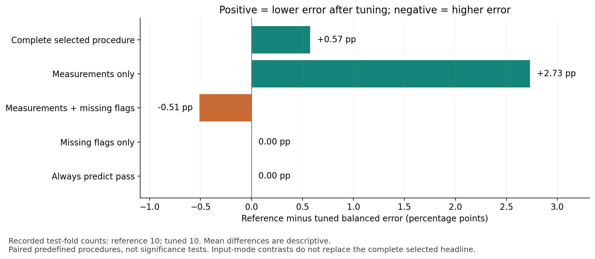
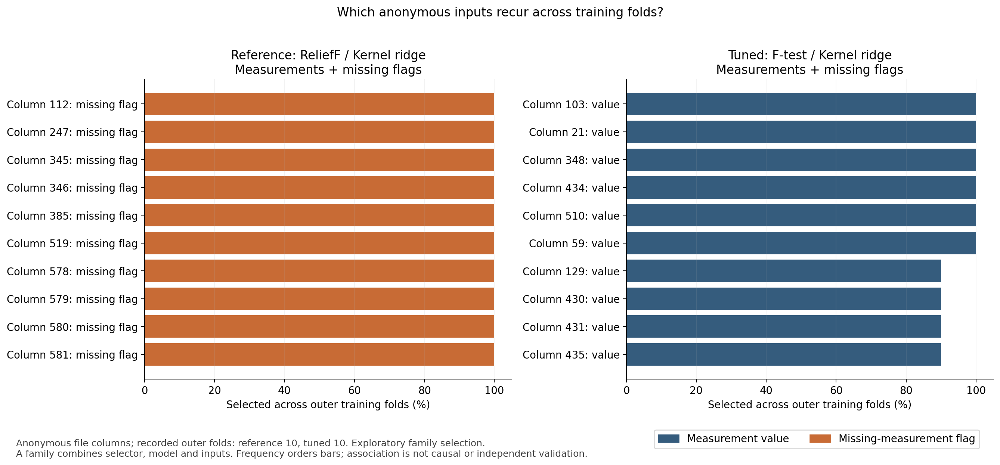
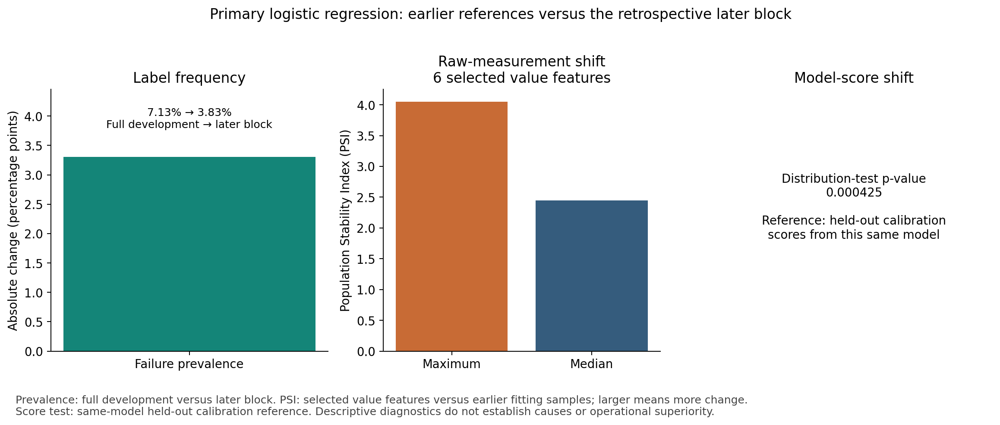
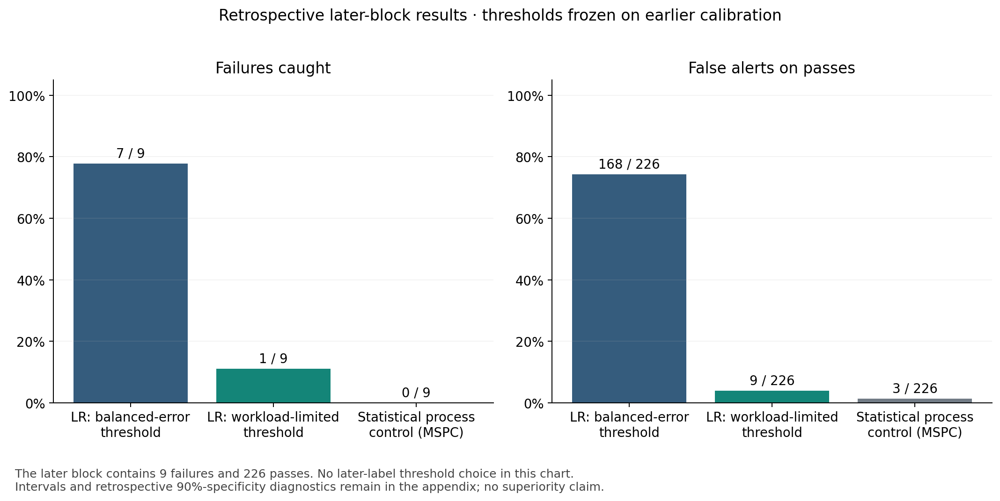
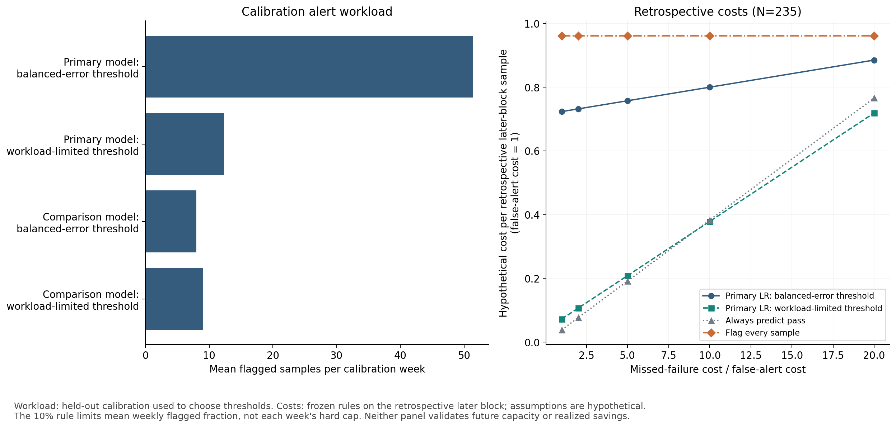

# SECOM Benchmark-First Yield Monitoring Study

_Generated: 2026-10-03 19:37_
_Source run: `runs\finalization_20261003_optimized_v3`_

This report summarizes the benchmark replication, tuned benchmark, and temporal robustness outputs from the active SECOM study artifacts. The benchmark results are the primary evidence; the temporal study is a stricter stress test of robustness under chronological shift.

## Executive Summary

- The benchmark studies evaluate association between SECOM measurements and recorded pass/fail labels; they do not establish early warning, causal drivers, or production readiness.
- The strongest original replication row is `ReliefF` / `krr` / `with_missing_indicators` with mean BER `0.292`.
- The strongest tuned benchmark row is `F-test` / `logreg` / `with_missing_indicators` with mean BER `0.309`.
- The tuned benchmark should be read as the more conservative estimate because hyperparameters are selected inside nested cross-validation.
- The temporal study selected `ReliefF` as the primary chronological candidate.
- There are `1` active temporal claim restriction(s); temporal lockbox findings remain descriptive rather than confirmatory.

## What I Built

- A reproducible original benchmark replication workflow that keeps preprocessing and feature selection strictly inside the training folds.
- A tuned benchmark workflow that preserves the selector family while adding nested hyperparameter search and threshold-free inner selection.
- A temporal robustness workflow with chronological DEV/LOCKBOX evaluation, drift gating, and explicit claim restrictions.
- Artifact-driven audit and reporting outputs so results can be traced back to versioned manifests, metrics tables, and study statuses.

## Dataset and Study Scope

The active study is intentionally benchmark-first. It asks whether SECOM process measurements contain usable signal for downstream fail detection under a faithful literature-style protocol, then whether a stricter tuned benchmark changes that conclusion, and finally how those findings behave under future-looking temporal stress. This ordering matters: the benchmark studies support the core claim, while the temporal study tests robustness without being allowed to erase valid benchmark evidence by default.

The input files contain **1,567 samples × 590 measurement columns**, with 1,463 passes and 104 failures (6.64%). There are 41,951 missing measurement cells (4.54%). Valid test timestamps span 2008-07-19T11:55:00 to 2008-10-17T06:07:00; no rows were dropped.

The [UCI metadata](https://archive.ics.uci.edu/dataset/179/secom) and original paper describe 591 features; the distributed measurement file has 590 columns. Feature names here are zero-based source positions (`X0` through `X589` and missing indicators `M0` through `M589`). A row is a production entity, with no documented physical unit or assurance that measurements precede the outcome. The target is the recorded test pass/fail label; early intervention benefit is unmeasured.

An all-pass rule has accuracy 93.36%, TPR 0, TNR 1 and BER 0.500. This is why BER and both class recalls lead the analysis.

## Original Replication Design

The original replication keeps a fixed feature budget, compares the literature-style selector and classifier families, and treats missing-indicator features as a paired ablation. The key result is not just the best row, but the fact that multiple selector/classifier combinations remain materially better than trivial failure detection.
Original classifier configurations are selected from the same non-nested replication sweep used for reporting, so tuned benchmark results remain the stricter estimate.

## Original Replication Search Summary

### Original Search Space

| selector | classifier | mode | evaluated_configs | k_values | c_values | alpha_values | gamma_values | n_neighbors_values |
|---|---|---|---|---|---|---|---|---|
| S2N | krr | strict | 12 | 1 | 0 | 3 | 3 | 0 |
| S2N | logreg | strict | 4 | 1 | 4 | 0 | 0 | 0 |
| S2N | krr | with_missing_indicators | 12 | 1 | 0 | 3 | 3 | 0 |
| S2N | logreg | with_missing_indicators | 4 | 1 | 4 | 0 | 0 | 0 |
| Ttest | krr | strict | 12 | 1 | 0 | 3 | 3 | 0 |
| Ttest | logreg | strict | 4 | 1 | 4 | 0 | 0 | 0 |
| Ttest | krr | with_missing_indicators | 12 | 1 | 0 | 3 | 3 | 0 |
| Ttest | logreg | with_missing_indicators | 4 | 1 | 4 | 0 | 0 | 0 |
| F-test | krr | strict | 12 | 1 | 0 | 3 | 3 | 0 |
| F-test | logreg | strict | 4 | 1 | 4 | 0 | 0 | 0 |
| F-test | krr | with_missing_indicators | 12 | 1 | 0 | 3 | 3 | 0 |
| F-test | logreg | with_missing_indicators | 4 | 1 | 4 | 0 | 0 | 0 |
| ReliefF | krr | strict | 12 | 1 | 0 | 3 | 3 | 1 |
| ReliefF | logreg | strict | 4 | 1 | 4 | 0 | 0 | 1 |
| ReliefF | krr | with_missing_indicators | 12 | 1 | 0 | 3 | 3 | 1 |
| ReliefF | logreg | with_missing_indicators | 4 | 1 | 4 | 0 | 0 | 1 |
| Gram-Schmidt | krr | strict | 12 | 1 | 0 | 3 | 3 | 0 |
| Gram-Schmidt | logreg | strict | 4 | 1 | 4 | 0 | 0 | 0 |
| Gram-Schmidt | krr | with_missing_indicators | 12 | 1 | 0 | 3 | 3 | 0 |
| Gram-Schmidt | logreg | with_missing_indicators | 4 | 1 | 4 | 0 | 0 | 0 |
| Pearson | krr | strict | 12 | 1 | 0 | 3 | 3 | 0 |
| Pearson | logreg | strict | 4 | 1 | 4 | 0 | 0 | 0 |
| Pearson | krr | with_missing_indicators | 12 | 1 | 0 | 3 | 3 | 0 |
| Pearson | logreg | with_missing_indicators | 4 | 1 | 4 | 0 | 0 | 0 |

### Original Selected Configurations

| selector | classifier | mode | k | C | alpha | gamma | n_neighbors | mean_BER |
|---|---|---|---|---|---|---|---|---|
| ReliefF | krr | with_missing_indicators | 40 | n/a | 1.000 | 0.010 | 10.000 | 0.292 |
| ReliefF | logreg | with_missing_indicators | 40 | 1.000 | n/a | n/a | 10.000 | 0.309 |
| F-test | krr | strict | 40 | n/a | 10.000 | 0.010 | n/a | 0.310 |
| Pearson | krr | strict | 40 | n/a | 10.000 | 0.010 | n/a | 0.310 |
| Ttest | krr | strict | 40 | n/a | 10.000 | 0.010 | n/a | 0.310 |
| F-test | logreg | with_missing_indicators | 40 | 1.000 | n/a | n/a | n/a | 0.312 |
| Pearson | logreg | with_missing_indicators | 40 | 1.000 | n/a | n/a | n/a | 0.312 |
| Ttest | logreg | with_missing_indicators | 40 | 1.000 | n/a | n/a | n/a | 0.312 |
| ReliefF | krr | strict | 40 | n/a | 1.000 | 0.010 | 10.000 | 0.325 |
| F-test | krr | with_missing_indicators | 40 | n/a | 10.000 | 0.010 | n/a | 0.328 |
| Pearson | krr | with_missing_indicators | 40 | n/a | 10.000 | 0.010 | n/a | 0.328 |
| Ttest | krr | with_missing_indicators | 40 | n/a | 10.000 | 0.010 | n/a | 0.328 |
| F-test | logreg | strict | 40 | 1.000 | n/a | n/a | n/a | 0.333 |
| Pearson | logreg | strict | 40 | 1.000 | n/a | n/a | n/a | 0.333 |
| Ttest | logreg | strict | 40 | 1.000 | n/a | n/a | n/a | 0.333 |
| ReliefF | logreg | strict | 40 | 0.100 | n/a | n/a | 10.000 | 0.334 |
| Gram-Schmidt | krr | strict | 40 | n/a | 10.000 | 0.010 | n/a | 0.335 |
| S2N | logreg | strict | 40 | 10.000 | n/a | n/a | n/a | 0.345 |
| S2N | krr | with_missing_indicators | 40 | n/a | 10.000 | 0.010 | n/a | 0.346 |
| S2N | krr | strict | 40 | n/a | 1.000 | 0.010 | n/a | 0.353 |
| Gram-Schmidt | krr | with_missing_indicators | 40 | n/a | 10.000 | 0.010 | n/a | 0.354 |
| Gram-Schmidt | logreg | strict | 40 | 0.010 | n/a | n/a | n/a | 0.358 |
| S2N | logreg | with_missing_indicators | 40 | 0.100 | n/a | n/a | n/a | 0.376 |
| Gram-Schmidt | logreg | with_missing_indicators | 40 | 10.000 | n/a | n/a | n/a | 0.382 |

## Original Replication Results

### Primary Benchmark Evidence

| selector | classifier | mode | mean_BER | CI_low | CI_high | mean_TPR | mean_TNR |
|---|---|---|---|---|---|---|---|
| ReliefF | krr | with_missing_indicators | 0.292 | 0.241 | 0.341 | 0.627 | 0.788 |
| ReliefF | logreg | with_missing_indicators | 0.309 | 0.230 | 0.380 | 0.646 | 0.735 |
| F-test | krr | strict | 0.310 | 0.270 | 0.352 | 0.625 | 0.754 |
| Pearson | krr | strict | 0.310 | 0.270 | 0.352 | 0.625 | 0.754 |
| Ttest | krr | strict | 0.310 | 0.270 | 0.352 | 0.625 | 0.754 |
| F-test | logreg | with_missing_indicators | 0.312 | 0.272 | 0.351 | 0.626 | 0.749 |
| Pearson | logreg | with_missing_indicators | 0.312 | 0.272 | 0.351 | 0.626 | 0.749 |
| Ttest | logreg | with_missing_indicators | 0.312 | 0.272 | 0.351 | 0.626 | 0.749 |
| ReliefF | krr | strict | 0.325 | 0.280 | 0.368 | 0.532 | 0.819 |
| F-test | krr | with_missing_indicators | 0.328 | 0.302 | 0.358 | 0.567 | 0.776 |
| Pearson | krr | with_missing_indicators | 0.328 | 0.302 | 0.358 | 0.567 | 0.776 |
| Ttest | krr | with_missing_indicators | 0.328 | 0.302 | 0.358 | 0.567 | 0.776 |
| F-test | logreg | strict | 0.333 | 0.284 | 0.376 | 0.597 | 0.737 |
| Pearson | logreg | strict | 0.333 | 0.284 | 0.376 | 0.597 | 0.737 |
| Ttest | logreg | strict | 0.333 | 0.284 | 0.376 | 0.597 | 0.737 |
| ReliefF | logreg | strict | 0.334 | 0.264 | 0.392 | 0.627 | 0.704 |
| Gram-Schmidt | krr | strict | 0.335 | 0.294 | 0.379 | 0.523 | 0.807 |
| S2N | logreg | strict | 0.345 | 0.285 | 0.404 | 0.597 | 0.714 |
| S2N | krr | with_missing_indicators | 0.346 | 0.296 | 0.384 | 0.549 | 0.758 |
| S2N | krr | strict | 0.353 | 0.287 | 0.406 | 0.482 | 0.811 |
| Gram-Schmidt | krr | with_missing_indicators | 0.354 | 0.310 | 0.403 | 0.492 | 0.800 |
| Gram-Schmidt | logreg | strict | 0.358 | 0.326 | 0.389 | 0.493 | 0.792 |
| S2N | logreg | with_missing_indicators | 0.376 | 0.327 | 0.421 | 0.565 | 0.684 |
| Gram-Schmidt | logreg | with_missing_indicators | 0.382 | 0.333 | 0.437 | 0.482 | 0.754 |

### UCI Original Benchmark Reference

The [UCI dataset page](https://archive.ics.uci.edu/dataset/179/secom) describes these 40-feature, 10-fold results as kernel ridge regression, while Table 1 in the [original paper](https://proceedings.mlr.press/v6/mccann10a/mccann10a.pdf) labels the classifier Naive Bayes. Local columns use strict KRR rows. These numbers are reference context, not proof of an exact reproduction of the original classifier protocol.

| UCI method | local selector | UCI BER % | UCI True+ % | UCI True- % | local BER % | local True+ % | local True- % |
|---|---|---|---|---|---|---|---|
| S2N | S2N | 34.5 +/- 2.6 | 57.8 +/- 5.3 | 73.1 +/- 2.1 | 35.3 | 48.2 | 81.1 |
| Ttest | Ttest | 33.7 +/- 2.1 | 59.6 +/- 4.7 | 73.0 +/- 1.8 | 31.0 | 62.5 | 75.4 |
| Relief | ReliefF | 40.1 +/- 2.8 | 48.3 +/- 5.9 | 71.6 +/- 3.2 | 32.5 | 53.2 | 81.9 |
| Pearson | Pearson | 34.1 +/- 2.0 | 57.4 +/- 4.3 | 74.4 +/- 4.9 | 31.0 | 62.5 | 75.4 |
| Ftest | F-test | 33.5 +/- 2.2 | 59.1 +/- 4.8 | 73.8 +/- 1.8 | 31.0 | 62.5 | 75.4 |
| Gram Schmidt | Gram-Schmidt | 35.6 +/- 2.4 | 51.2 +/- 11.8 | 77.5 +/- 2.3 | 33.5 | 52.3 | 80.7 |

Interpretation note: the local Ttest row uses a pooled two-sample t statistic to align with the UCI selector label; Welch-t remains available only as an explicit local selector. Binary-label ANOVA F-test ranking and absolute Pearson correlation ranking are mathematically monotonic for non-constant features, so they can select the same 40-feature set and produce identical local rows. The UCI reference table reports separate Ftest and Pearson rows, which should be read as that benchmark's implementation/protocol definitions rather than a guarantee that the two selectors are distinct under this replication.

### Supporting Benchmark Metrics

| selector | classifier | mode | mean_ROC_AUC | mean_PR_AUC | mean_MCC | mean_F2 |
|---|---|---|---|---|---|---|
| ReliefF | krr | with_missing_indicators | 0.750 | 0.242 | 0.244 | 0.410 |
| ReliefF | logreg | with_missing_indicators | 0.742 | 0.253 | 0.218 | 0.392 |
| F-test | krr | strict | 0.734 | 0.205 | 0.217 | 0.390 |
| Pearson | krr | strict | 0.734 | 0.205 | 0.217 | 0.390 |
| Ttest | krr | strict | 0.734 | 0.205 | 0.217 | 0.390 |
| F-test | logreg | with_missing_indicators | 0.732 | 0.198 | 0.211 | 0.383 |
| Pearson | logreg | with_missing_indicators | 0.732 | 0.198 | 0.211 | 0.383 |
| Ttest | logreg | with_missing_indicators | 0.732 | 0.198 | 0.211 | 0.383 |
| ReliefF | krr | strict | 0.763 | 0.233 | 0.223 | 0.376 |
| F-test | krr | with_missing_indicators | 0.734 | 0.207 | 0.202 | 0.369 |
| Pearson | krr | with_missing_indicators | 0.734 | 0.207 | 0.202 | 0.369 |
| Ttest | krr | with_missing_indicators | 0.734 | 0.207 | 0.202 | 0.369 |
| F-test | logreg | strict | 0.723 | 0.195 | 0.187 | 0.360 |
| Pearson | logreg | strict | 0.723 | 0.195 | 0.187 | 0.360 |
| Ttest | logreg | strict | 0.723 | 0.195 | 0.187 | 0.360 |
| ReliefF | logreg | strict | 0.736 | 0.212 | 0.177 | 0.356 |
| Gram-Schmidt | krr | strict | 0.709 | 0.203 | 0.199 | 0.354 |
| S2N | logreg | strict | 0.687 | 0.171 | 0.170 | 0.347 |
| S2N | krr | with_missing_indicators | 0.716 | 0.188 | 0.178 | 0.346 |
| S2N | krr | strict | 0.699 | 0.188 | 0.182 | 0.338 |
| Gram-Schmidt | krr | with_missing_indicators | 0.707 | 0.212 | 0.176 | 0.330 |
| Gram-Schmidt | logreg | strict | 0.703 | 0.192 | 0.169 | 0.329 |
| S2N | logreg | with_missing_indicators | 0.694 | 0.181 | 0.133 | 0.312 |
| Gram-Schmidt | logreg | with_missing_indicators | 0.688 | 0.182 | 0.139 | 0.305 |

Figure 1 shows the leading rows including replication mode. Bars are descriptive 95% fold-bootstrap confidence intervals over ten fold metrics; overlapping training sets and post-hoc family selection prevent treating them as independent confirmation of superiority.

### Missing-Indicator Ablation

- `S2N` / `krr` changes mean BER by `0.007` (strict minus missing-indicator BER; positive means improvement).
- `S2N` / `logreg` changes mean BER by `-0.031` (strict minus missing-indicator BER; positive means improvement).
- `Ttest` / `krr` changes mean BER by `-0.018` (strict minus missing-indicator BER; positive means improvement).
- `Ttest` / `logreg` changes mean BER by `0.021` (strict minus missing-indicator BER; positive means improvement).
- `F-test` / `krr` changes mean BER by `-0.018` (strict minus missing-indicator BER; positive means improvement).
- `F-test` / `logreg` changes mean BER by `0.021` (strict minus missing-indicator BER; positive means improvement).
- `ReliefF` / `krr` changes mean BER by `0.032` (strict minus missing-indicator BER; positive means improvement).
- `ReliefF` / `logreg` changes mean BER by `0.025` (strict minus missing-indicator BER; positive means improvement).
- `Gram-Schmidt` / `krr` changes mean BER by `-0.019` (strict minus missing-indicator BER; positive means improvement).
- `Gram-Schmidt` / `logreg` changes mean BER by `-0.025` (strict minus missing-indicator BER; positive means improvement).
- `Pearson` / `krr` changes mean BER by `-0.018` (strict minus missing-indicator BER; positive means improvement).
- `Pearson` / `logreg` changes mean BER by `0.021` (strict minus missing-indicator BER; positive means improvement).

## Tuned Benchmark Design

The tuned benchmark selects hyperparameters inside nested cross-validation separately for each selector/classifier/mode family. The leading family is selected retrospectively from the outer-fold results, so its minimum BER is descriptive rather than an independently validated champion estimate. That makes the tuned results a better estimate of what a disciplined tuning process achieves on unseen folds, even when the headline BER ends up slightly worse than the best original replication row.

## Tuned Benchmark Search Summary

### Tuned Search Space

| selector | classifier | mode | evaluated_configs | k_values | c_values | alpha_values | gamma_values | n_neighbors_values |
|---|---|---|---|---|---|---|---|---|
| S2N | krr | strict | 360 | 3 | 0 | 3 | 3 | 0 |
| S2N | logreg | strict | 120 | 3 | 4 | 0 | 0 | 0 |
| S2N | krr | with_missing_indicators | 360 | 3 | 0 | 3 | 3 | 0 |
| S2N | logreg | with_missing_indicators | 120 | 3 | 4 | 0 | 0 | 0 |
| Ttest | krr | strict | 360 | 3 | 0 | 3 | 3 | 0 |
| Ttest | logreg | strict | 120 | 3 | 4 | 0 | 0 | 0 |
| Ttest | krr | with_missing_indicators | 360 | 3 | 0 | 3 | 3 | 0 |
| Ttest | logreg | with_missing_indicators | 120 | 3 | 4 | 0 | 0 | 0 |
| F-test | krr | strict | 360 | 3 | 0 | 3 | 3 | 0 |
| F-test | logreg | strict | 120 | 3 | 4 | 0 | 0 | 0 |
| F-test | krr | with_missing_indicators | 360 | 3 | 0 | 3 | 3 | 0 |
| F-test | logreg | with_missing_indicators | 120 | 3 | 4 | 0 | 0 | 0 |
| ReliefF | krr | strict | 1080 | 3 | 0 | 3 | 3 | 3 |
| ReliefF | logreg | strict | 360 | 3 | 4 | 0 | 0 | 3 |
| ReliefF | krr | with_missing_indicators | 1080 | 3 | 0 | 3 | 3 | 3 |
| ReliefF | logreg | with_missing_indicators | 360 | 3 | 4 | 0 | 0 | 3 |
| Gram-Schmidt | krr | strict | 360 | 3 | 0 | 3 | 3 | 0 |
| Gram-Schmidt | logreg | strict | 120 | 3 | 4 | 0 | 0 | 0 |
| Gram-Schmidt | krr | with_missing_indicators | 360 | 3 | 0 | 3 | 3 | 0 |
| Gram-Schmidt | logreg | with_missing_indicators | 120 | 3 | 4 | 0 | 0 | 0 |

### Modal Selected Configurations

| selector | classifier | mode | k | C | alpha | gamma | n_neighbors | selected_count | mean_inner_ROC_AUC | mean_inner_BER |
|---|---|---|---|---|---|---|---|---|---|---|
| ReliefF | krr | strict | 10 | n/a | 10.000 | n/a | 10.000 | 3 | 0.747 | 0.299 |
| F-test | krr | with_missing_indicators | 20 | n/a | 10.000 | n/a | n/a | 3 | 0.700 | 0.347 |
| Ttest | krr | with_missing_indicators | 20 | n/a | 10.000 | n/a | n/a | 3 | 0.700 | 0.347 |
| F-test | logreg | strict | 20 | 0.010 | n/a | n/a | n/a | 5 | 0.697 | 0.339 |
| Ttest | logreg | strict | 20 | 0.010 | n/a | n/a | n/a | 5 | 0.697 | 0.339 |
| S2N | krr | strict | 20 | n/a | 1.000 | 0.010 | n/a | 3 | 0.699 | 0.345 |
| Gram-Schmidt | krr | with_missing_indicators | 20 | n/a | 10.000 | n/a | n/a | 4 | 0.706 | 0.369 |
| ReliefF | logreg | with_missing_indicators | 20 | 10.000 | n/a | n/a | 5.000 | 3 | 0.722 | 0.301 |
| S2N | logreg | strict | 20 | 0.010 | n/a | n/a | n/a | 4 | 0.704 | 0.349 |
| S2N | krr | with_missing_indicators | 20 | n/a | 10.000 | n/a | n/a | 4 | 0.714 | 0.351 |
| F-test | logreg | with_missing_indicators | 20 | 0.010 | n/a | n/a | n/a | 4 | 0.700 | 0.334 |
| Ttest | logreg | with_missing_indicators | 20 | 0.010 | n/a | n/a | n/a | 4 | 0.700 | 0.334 |
| F-test | krr | strict | 40 | n/a | 10.000 | 0.010 | n/a | 3 | 0.720 | 0.336 |
| Ttest | krr | strict | 40 | n/a | 10.000 | 0.010 | n/a | 3 | 0.720 | 0.336 |
| Gram-Schmidt | krr | strict | 10 | n/a | 10.000 | 0.010 | n/a | 4 | 0.684 | 0.350 |
| Gram-Schmidt | logreg | strict | 10 | 0.010 | n/a | n/a | n/a | 4 | 0.679 | 0.351 |
| Gram-Schmidt | logreg | with_missing_indicators | 10 | 0.010 | n/a | n/a | n/a | 3 | 0.671 | 0.353 |
| S2N | logreg | with_missing_indicators | 10 | 0.010 | n/a | n/a | n/a | 2 | 0.700 | 0.339 |
| ReliefF | krr | with_missing_indicators | 40 | n/a | 10.000 | n/a | 5.000 | 2 | 0.746 | 0.303 |
| ReliefF | logreg | strict | 20 | 10.000 | n/a | n/a | 5.000 | 2 | 0.746 | 0.304 |

## Tuned Benchmark Results

### Primary Tuned Evidence

| selector | classifier | mode | mean_BER | CI_low | CI_high | mean_TPR | mean_TNR |
|---|---|---|---|---|---|---|---|
| F-test | logreg | with_missing_indicators | 0.309 | 0.253 | 0.356 | 0.685 | 0.697 |
| Ttest | logreg | with_missing_indicators | 0.309 | 0.253 | 0.356 | 0.685 | 0.697 |
| F-test | logreg | strict | 0.310 | 0.266 | 0.352 | 0.685 | 0.695 |
| Ttest | logreg | strict | 0.310 | 0.266 | 0.352 | 0.685 | 0.695 |
| ReliefF | krr | strict | 0.319 | 0.269 | 0.366 | 0.625 | 0.736 |
| ReliefF | krr | with_missing_indicators | 0.323 | 0.270 | 0.376 | 0.560 | 0.794 |
| ReliefF | logreg | with_missing_indicators | 0.333 | 0.282 | 0.376 | 0.590 | 0.744 |
| ReliefF | logreg | strict | 0.336 | 0.272 | 0.393 | 0.605 | 0.722 |
| S2N | logreg | strict | 0.339 | 0.290 | 0.386 | 0.646 | 0.675 |
| Gram-Schmidt | krr | with_missing_indicators | 0.341 | 0.305 | 0.380 | 0.519 | 0.798 |
| S2N | krr | strict | 0.344 | 0.297 | 0.381 | 0.539 | 0.772 |
| S2N | logreg | with_missing_indicators | 0.347 | 0.300 | 0.394 | 0.606 | 0.699 |
| F-test | krr | strict | 0.354 | 0.291 | 0.417 | 0.530 | 0.763 |
| Ttest | krr | strict | 0.354 | 0.291 | 0.417 | 0.530 | 0.763 |
| F-test | krr | with_missing_indicators | 0.354 | 0.306 | 0.405 | 0.521 | 0.771 |
| Ttest | krr | with_missing_indicators | 0.354 | 0.306 | 0.405 | 0.521 | 0.771 |
| S2N | krr | with_missing_indicators | 0.360 | 0.299 | 0.415 | 0.507 | 0.773 |
| Gram-Schmidt | logreg | strict | 0.361 | 0.316 | 0.404 | 0.528 | 0.750 |
| Gram-Schmidt | krr | strict | 0.365 | 0.315 | 0.409 | 0.474 | 0.796 |
| Gram-Schmidt | logreg | with_missing_indicators | 0.377 | 0.336 | 0.418 | 0.468 | 0.777 |

### Supporting Tuned Metrics

| selector | classifier | mode | mean_ROC_AUC | mean_PR_AUC | mean_MCC | mean_F2 |
|---|---|---|---|---|---|---|
| F-test | logreg | with_missing_indicators | 0.731 | 0.198 | 0.208 | 0.385 |
| Ttest | logreg | with_missing_indicators | 0.731 | 0.198 | 0.208 | 0.385 |
| F-test | logreg | strict | 0.739 | 0.204 | 0.205 | 0.383 |
| Ttest | logreg | strict | 0.739 | 0.204 | 0.205 | 0.383 |
| ReliefF | krr | strict | 0.722 | 0.219 | 0.205 | 0.377 |
| ReliefF | krr | with_missing_indicators | 0.742 | 0.235 | 0.209 | 0.368 |
| ReliefF | logreg | with_missing_indicators | 0.725 | 0.236 | 0.188 | 0.355 |
| ReliefF | logreg | strict | 0.723 | 0.221 | 0.183 | 0.361 |
| S2N | logreg | strict | 0.721 | 0.186 | 0.177 | 0.357 |
| Gram-Schmidt | krr | with_missing_indicators | 0.729 | 0.224 | 0.195 | 0.351 |
| S2N | krr | strict | 0.714 | 0.174 | 0.182 | 0.350 |
| S2N | logreg | with_missing_indicators | 0.706 | 0.184 | 0.166 | 0.341 |
| F-test | krr | strict | 0.712 | 0.188 | 0.160 | 0.320 |
| Ttest | krr | strict | 0.712 | 0.188 | 0.160 | 0.320 |
| F-test | krr | with_missing_indicators | 0.710 | 0.191 | 0.170 | 0.331 |
| Ttest | krr | with_missing_indicators | 0.710 | 0.191 | 0.170 | 0.331 |
| S2N | krr | with_missing_indicators | 0.697 | 0.170 | 0.165 | 0.328 |
| Gram-Schmidt | logreg | strict | 0.721 | 0.191 | 0.158 | 0.326 |
| Gram-Schmidt | krr | strict | 0.712 | 0.188 | 0.155 | 0.300 |
| Gram-Schmidt | logreg | with_missing_indicators | 0.708 | 0.201 | 0.149 | 0.309 |

### Tuned Missing-Indicator Ablation

| selector | classifier | BER_reference | BER_missing_indicator | delta_BER |
|---|---|---|---|---|
| S2N | krr | 0.344 | 0.360 | -0.016 |
| S2N | logreg | 0.339 | 0.347 | -0.008 |
| Ttest | krr | 0.354 | 0.354 | -0.000482 |
| Ttest | logreg | 0.310 | 0.309 | 0.001 |
| F-test | krr | 0.354 | 0.354 | -0.000482 |
| F-test | logreg | 0.310 | 0.309 | 0.001 |
| ReliefF | krr | 0.319 | 0.323 | -0.004 |
| ReliefF | logreg | 0.336 | 0.333 | 0.003 |
| Gram-Schmidt | krr | 0.365 | 0.341 | 0.024 |
| Gram-Schmidt | logreg | 0.361 | 0.377 | -0.016 |
Positive delta is strict minus missing-indicator BER: a BER reduction. Deltas compare paired outer-fold means; no independent industrial benefit is established.

### Tuned Selection Stability

- The most frequently selected tuned configuration is `F-test` / `logreg` / `strict` with `k=20` and selection count `5`.

## Original vs Tuned Comparison

| study | selector | classifier | mode | mean_BER | mean_ROC_AUC |
|---|---|---|---|---|---|
| original | ReliefF | krr | with_missing_indicators | 0.292 | 0.750 |
| tuned | F-test | logreg | with_missing_indicators | 0.309 | 0.731 |

- Relative to the best original replication row, the tuned benchmark is worse by `0.017` BER. That is consistent with the stricter nested-CV evaluation protocol.

Figure 2 highlights how much stricter nested cross-validation changes BER for matched selector/classifier/mode configurations.

## Feature Stability and Interpretation

Feature outputs are model-prioritization evidence from resampled benchmark artifacts, not causal proof or validated process-driver identification. Stability across resamples matters more than a single full-fit ranking, and missing-indicator features are kept distinct from raw value features.

### Original Replication

- Feature outputs are model-prioritization evidence from resampled benchmark artifacts, not causal proof or validated process-driver identification. Stability across resamples matters more than a single full-fit ranking, and missing-indicator features are kept distinct from raw value features.
- Effect magnitudes are unavailable for the leading classifier, so this table is shown as a stability-first view.

| feature | type | selection_frequency | cluster_id |
|---|---|---:|---:|
| M112 | missing_indicator | 1.000 | n/a |
| M247 | missing_indicator | 1.000 | n/a |
| M345 | missing_indicator | 1.000 | n/a |
| M346 | missing_indicator | 1.000 | n/a |
| M385 | missing_indicator | 1.000 | n/a |
| M519 | missing_indicator | 1.000 | n/a |
| M578 | missing_indicator | 1.000 | n/a |
| M579 | missing_indicator | 1.000 | n/a |
| M580 | missing_indicator | 1.000 | n/a |
| M581 | missing_indicator | 1.000 | n/a |

### Tuned Benchmark

- Feature outputs are model-prioritization evidence from resampled benchmark artifacts, not causal proof or validated process-driver identification. Stability across resamples matters more than a single full-fit ranking, and missing-indicator features are kept distinct from raw value features.

| feature | type | selection_frequency | effect_magnitude | expected_contribution | cluster_id |
|---|---|---:|---:|---:|---:|
| X59 | value | 1.000 | 0.316 | 0.316 | 57.000 |
| X21 | value | 0.900 | 0.312 | 0.281 | 21.000 |
| X129 | value | 0.800 | 0.273 | 0.219 | 122.000 |
| X348 | value | 1.000 | 0.174 | 0.174 | 268.000 |
| X103 | value | 1.000 | 0.166 | 0.166 | 100.000 |
| X510 | value | 1.000 | 0.117 | 0.117 | 350.000 |
| X124 | value | 0.400 | 0.192 | 0.077 | 118.000 |
| X28 | value | 0.700 | 0.103 | 0.072 | 27.000 |
| X436 | value | 0.700 | 0.075 | 0.053 | 304.000 |
| X298 | value | 0.600 | 0.056 | 0.033 | 152.000 |

### Missingness Context

These full-sample diagnostics explain selected missing indicators; they are not additional model validation or causal evidence.

- `M112`, `M247`, `M385`, `M519` have identical missingness masks. Missing rate by month: 2008-07: 31.7%; 2008-08: 17.5%; 2008-09: 46.9%; 2008-10: 89.4%. Overall pass/fail missing rates: 46.6% / 31.7%.
- `M72`, `M73`, `M345`, `M346` have identical missingness masks. Missing rate by month: 2008-07: 15.9%; 2008-08: 32.3%; 2008-09: 62.0%; 2008-10: 66.6%. Overall pass/fail missing rates: 51.8% / 34.6%.
- `M578`, `M579`, `M580`, `M581` have identical missingness masks. Missing rate by month: 2008-07: 23.8%; 2008-08: 62.2%; 2008-09: 68.6%; 2008-10: 51.3%. Overall pass/fail missing rates: 60.8% / 56.7%.

Co-occurring missingness can encode acquisition regime or time as well as process state. Repeated selection does not identify independent sensor effects, root causes, or a stable deployment signal.

### Logistic Regression Association Diagnostics

For logistic regression, effect magnitude is the absolute coefficient from a full-data fit after the chosen preprocessing. Expected contribution is selection frequency × that magnitude, a prioritization heuristic. These are in-sample associations conditional on the selected features; they are not causal effects or validated failure probabilities. RBF KRR has no comparable coefficient, so its effect and contribution fields remain unavailable.

#### Original: ReliefF / logreg / with_missing_indicators

- Feature outputs are model-prioritization evidence from resampled benchmark artifacts, not causal proof or validated process-driver identification. Stability across resamples matters more than a single full-fit ranking, and missing-indicator features are kept distinct from raw value features.

| feature | type | selection_frequency | effect_magnitude | expected_contribution | cluster_id |
|---|---|---:|---:|---:|---:|
| X59 | value | 1.000 | 1.051 | 1.051 | 57.000 |
| X406 | value | 1.000 | 0.967 | 0.967 | 247.000 |
| X267 | value | 1.000 | 0.945 | 0.945 | 246.000 |
| X62 | value | 1.000 | 0.675 | 0.675 | 60.000 |
| X348 | value | 1.000 | 0.669 | 0.669 | 268.000 |
| X455 | value | 1.000 | 0.648 | 0.648 | 170.000 |
| X45 | value | 0.600 | 0.957 | 0.574 | 43.000 |
| X70 | value | 1.000 | 0.522 | 0.522 | 68.000 |
| X540 | value | 1.000 | 0.513 | 0.513 | 247.000 |
| X539 | value | 1.000 | 0.506 | 0.506 | 246.000 |

#### Tuned: Ttest / logreg / with_missing_indicators

- Feature outputs are model-prioritization evidence from resampled benchmark artifacts, not causal proof or validated process-driver identification. Stability across resamples matters more than a single full-fit ranking, and missing-indicator features are kept distinct from raw value features.

| feature | type | selection_frequency | effect_magnitude | expected_contribution | cluster_id |
|---|---|---:|---:|---:|---:|
| X59 | value | 1.000 | 0.316 | 0.316 | 57.000 |
| X21 | value | 0.900 | 0.312 | 0.281 | 21.000 |
| X129 | value | 0.800 | 0.273 | 0.219 | 122.000 |
| X348 | value | 1.000 | 0.174 | 0.174 | 268.000 |
| X103 | value | 1.000 | 0.166 | 0.166 | 100.000 |
| X510 | value | 1.000 | 0.117 | 0.117 | 350.000 |
| X124 | value | 0.400 | 0.192 | 0.077 | 118.000 |
| X28 | value | 0.700 | 0.103 | 0.072 | 27.000 |
| X436 | value | 0.700 | 0.075 | 0.053 | 304.000 |
| X298 | value | 0.600 | 0.056 | 0.033 | 152.000 |

Figure 3 shows outer-fold selection frequency for one leading configuration per study in separate panels. Coefficient magnitudes are not combined with frequencies; blue denotes value features and orange denotes missing indicators.

## Temporal Robustness Stress Test

The temporal study is a chronological robustness stress test using balanced logistic regression, separate from the KRR benchmark anchor. It uses a chronological DEV/LOCKBOX split, time-aware model selection, threshold freeze, drift checks, and an MSPC comparison.

### Temporal Model Selection Summary

- Primary temporal selector under the temporal protocol: `ReliefF` with mean_BER=`0.471`.
- No challenger met the temporal eligibility rule.

#### Selector Ranking and Modal Configurations

| selector | status | mean_BER | mean_True+ | mean_True- | modal_k | modal_C | modal_scaler | modal_n_neighbors |
|---|---|---|---|---|---|---|---|---|
| ReliefF | primary | 0.471 | 0.164 | 0.893 | 20 | 0.100 | RobustScaler | 5.000 |
| F-test | supporting | 0.495 | 0.365 | 0.646 | 40 | 0.010 | StandardScaler | n/a |
| Ttest | supporting | 0.496 | 0.365 | 0.643 | 40 | 0.010 | StandardScaler | n/a |
| S2N | supporting | 0.521 | 0.285 | 0.674 | 40 | 0.100 | RobustScaler | n/a |
| Gram-Schmidt | supporting | 0.529 | 0.311 | 0.632 | 10 | 0.100 | StandardScaler | n/a |

### Drift and Claim Restrictions

- The current temporal run is drift-gated as `HIGH_SHIFT` with max PSI `5.125`.

| model_scope | drift_gate_status | lockbox_claims_allowed | abs_prevalence_shift | ks_pvalue_scores | max_PSI | median_PSI |
|---|---|---|---|---|---|---|
| primary | HIGH_SHIFT | False | 0.033 | 3.79e-08 | 5.125 | 0.569 |

- Active temporal claim restrictions:
  - `primary_high_shift_blocks_lockbox_superiority_claim`
- Lockbox evidence remains reportable, but restricted claims should be treated as descriptive rather than confirmatory.

### Lockbox Metrics

| role | threshold_policy | BER | True+ | True- | ROC_AUC | PR_AUC | MCC | F2 | TP | FP | TN | FN | lockbox_n | lockbox_fails |
|---|---|---|---|---|---|---|---|---|---|---|---|---|---|---|
| primary | operational | 0.389 | 0.222 | 1.000 | 0.757 | 0.534 | 0.464 | 0.263 | 2 | 0 | 226 | 7 | 235 | 9 |
| primary | scientific | 0.278 | 0.444 | 1.000 | 0.757 | 0.534 | 0.659 | 0.500 | 4 | 0 | 226 | 5 | 235 | 9 |

### Supervised vs MSPC

| scope | best_source | best_TPR_at_TNR90 | T2_AUC | Q_AUC |
|---|---|---|---|---|
| lockbox | T2 | 0.000 | 0.501 | 0.440 |

Figure 4 condenses the temporal drift gate into a small set of quantities that make the claim restriction visible without reading the full CSV.

Figure 5 compares retrospective lockbox ROC operating points at TNR ≥ 90%. These thresholds are chosen using lockbox labels and are diagnostic only; scientific and operational results use DEV-fitted frozen thresholds. Active restrictions prevent superiority claims.

Figure 6 combines weekly workload framing with illustrative cost curves so operational impact can be discussed without overstating production readiness.

## Industrialization Gaps

- No stable device/tool/chamber identifier for unseen-device validation.
- No intervention or maintenance history.
- No explicit regime-change metadata.
- No downstream decision or action outcome data.
- Anonymous features limit process interpretation.
- Single-dataset evidence only.
- Operational framing in this report is illustrative, not production-validated.

## Conclusions and Next Data Requirements

- The benchmark layer reproduces meaningful supervised signal, with the best original row at mean BER `0.292`.
- The tuned benchmark gives a stricter nested-CV estimate, with the best tuned row at mean BER `0.309`.
- The temporal study is informative but remains descriptive-only in this run because claim restrictions are active.
- Next data collection should add device- or tool-level identifiers, intervention logs, and longer-horizon cross-context validation.
- A production-grade study would also require deployment decision objectives and cost accounting.
- Stronger process claims would require additional data to support stronger causal or process claims.

## Provenance Appendix

- Generated artifact: `final_report.md`
- Source run directory: `runs\finalization_20261003_optimized_v3`
- Git commit: `3a016025b702e4c3166b4d931020987dae9ed6e5`
- Git dirty: `True`
- Python executable: `E:\GitHub\code\secom-yield-monitoring\.venv\Scripts\python.exe`
- Study spec path: `docs/spec`
- Study spec hash: `5c5ef3c040d1504116e7345213e7a44a8a04e807d4787bca9aaca02c4ed100f6`
- Primary study status: `passed`
- Original replication status: `passed`
- Tuned benchmark status: `passed`
- Temporal robustness status: `warning`
- Source tree content hash (LF normalized): `9c660d2bb051504fe86203e90797e1b60e3f14e4d8bca538bec4ea47a83f3814`
- A dirty run identifies the base Git commit plus exact source-file hashes; it does not claim the base commit contains the edits.
- Run started (UTC): `2026-10-04T00:15:39.798037+00:00`
- Modeling duration (seconds): `{'benchmark': 761.831, 'temporal': 494.964, 'total_modeling': 1256.79}`
- Input file SHA-256, resolved dependency versions, seeds, search grids and thread settings are recorded in `run_manifest.json`.
- Library versions:
  - `certifi`: `2026.7.22`
  - `matplotlib`: `3.10.9`
  - `numpy`: `2.4.6`
  - `pandas`: `3.0.3`
  - `python`: `3.12.12`
  - `scipy`: `1.17.1`
  - `sklearn`: `1.9.0`
  - `skrebate`: `0.8.4`
- Temporal claim restrictions:
  - `primary_high_shift_blocks_lockbox_superiority_claim`
